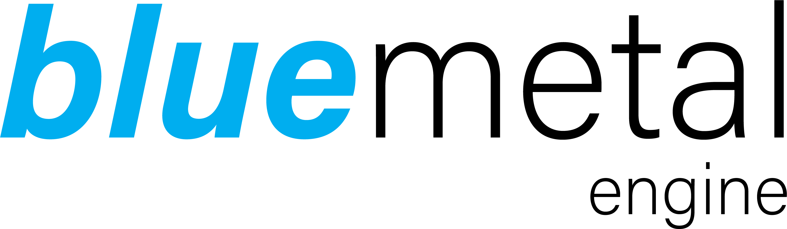

# Bluemetal Engine



Bluemetal Engine is a powerful and versatile game engine built using modern C++17/20 features. It incorporates cutting-edge technologies such as Vulkan Renderer, a custom configuration language called Noodle, Dear ImGui for user interface, and open-source libraries like SDL2 and VMA.

## Features

- **Use of Newer C++17/20 Features:** Bluemetal Engine takes advantage of the latest features provided by C++17/20, offering improved performance, better code organization, and enhanced productivity.

- **Vulkan Renderer:** The engine employs the Vulkan API, which provides high-performance graphics rendering capabilities. Vulkan enables efficient utilization of modern hardware, delivering stunning visuals and smooth gameplay.

- **Dear ImGui:** Bluemetal engine integrates Dear ImGui, a popular and intuitive user interface library. With Dear ImGui, developers can create and customize game tools, debug panels, and other graphical interfaces to enhance their workflow.

- **Open Source Libraries:** Bluemetal Engine leverages open-source libraries like SDL2 (Simple DirectMedia Layer) and VMA (Vulkan Memory Allocator) to streamline development and provide a solid foundation for cross-platform support, input handling, and efficient memory management.

#### Warning: Still in development, not production ready.


## Getting Started

Follow these steps to get started with Bluemetal Game Engine:

1. Clone the repository:
```
git clone https://github.com/cullvox/bluemetal.git
```

2. Install the necessary dependencies:
   - SDL2: Follow the installation instructions specific to your operating system from the official SDL website.
   - VMA: Refer to the VMA documentation for installation instructions.

3. Build the engine:
   - Navigate to the cloned repository's root directory.
   - Run the build command specific to your platform (e.g., `make`, `msbuild`, `cmake`, etc.).

4. Start developing your game using Bluemetal Game Engine!

## Contributing
Contributions to BlueMetal Game Engine are welcome! If you find any issues or have suggestions for improvements, please open an issue in the [Issue Tracker](https://github.com/cadenmiller/bluemetal/issues).

If you wish to contribute code, fork the repository, make your changes, and submit a pull request. Ensure that your code follows the project's coding conventions and includes appropriate tests and documentation.

## License

Bluemetal Engine is released under the [MIT License](LICENSE). Feel free to use, modify, and distribute the engine according to the terms of the license.

## Acknowledgments

Bluemetal Engine would not have been possible without the contributions and support of the following projects:

- [SDL2](https://www.libsdl.org/)
- [VMA](https://github.com/GPUOpen-LibrariesAndSDKs/VulkanMemoryAllocator)
- [Dear ImGui](https://github.com/ocornut/imgui)

We are grateful for the open-source community's efforts in creating and maintaining these fantastic libraries.

---

Thank you for your interest in Bluemetal Engine! This project is mostly a passion project for testing and examining C++ along with Vulkan.
Should you have any questions or encounter any issues, please don't hesitate to reach out. Happy coding!
